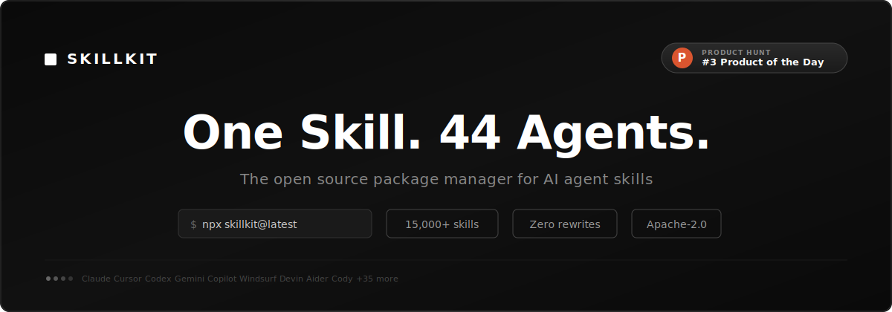

<div align="center">

<picture>
  <source media="(prefers-color-scheme: dark)" srcset="docs/img/banner.svg">
  <source media="(prefers-color-scheme: light)" srcset="docs/img/banner.svg">
  
</picture>

<br/>
<br/>

[](https://github.com/rohitg00/skillkit/actions/workflows/ci.yml)
[](https://www.npmjs.com/package/skillkit)
[](https://www.npmjs.com/package/skillkit)
[](https://github.com/rohitg00/skillkit/stargazers)
[](https://opensource.org/licenses/Apache-2.0)

**SkillKit** is the open source package manager for AI agent skills. Write a skill once, deploy it to **44 agents** — Claude, Cursor, Copilot, Windsurf, Devin, Codex, and 38 more. No rewrites. 15,000+ skills in the marketplace.

[Website](https://agenstskills.com) &middot; [Docs](https://agenstskills.com/docs) &middot; [API Explorer](https://agenstskills.com/api) &middot; [Chrome Extension](https://github.com/rohitg00/skillkit/tree/main/packages/extension#readme) &middot; [npm](https://www.npmjs.com/package/skillkit)

</div>

---

Skills make AI coding agents smarter. But every agent uses a different format:

| Agent | Format | Directory |
|-------|--------|-----------|
| Claude Code | `SKILL.md` | `.claude/skills/` |
| Cursor | `.mdc` | `.cursor/skills/` |
| Copilot | Markdown | `.github/skills/` |
| Windsurf | Markdown | `.windsurf/skills/` |

You end up rewriting the same skill for each agent, or locking into one platform.

**SkillKit fixes this.** Install from 15,000+ skills, auto-translate between formats, persist learnings with Memory. Works with Claude, Cursor, Windsurf, Copilot, and 40 more.

```bash
npx skillkit@latest
```

## See It In Action

<div align="center">

[](https://raw.githubusercontent.com/rohitg00/skillkit/main/docs/video/skillkit.mp4)

*Click the image above to watch the full demo*

</div>

## Quick Start

```bash
npx skillkit@latest init              # Detect agents, create dirs
skillkit recommend                    # Get smart suggestions
skillkit install anthropics/skills    # Install from marketplace
skillkit sync                         # Deploy to your agents
```

Four commands. Your agents now have skills for PDF processing, code review, and more.

## What Can You Do?

### Install skills from anywhere

```bash
skillkit install anthropics/skills          # GitHub
skillkit install gitlab:team/skills         # GitLab
skillkit install ./my-local-skills          # Local path
```

### Translate between agents

Write for Claude, deploy to Cursor:

```bash
skillkit translate my-skill --to cursor
skillkit translate --all --to windsurf
```

### Get smart recommendations

SkillKit reads your project, detects your stack, and suggests relevant skills:

```bash
skillkit recommend
# 92% vercel-react-best-practices
# 87% tailwind-v4-patterns
# 85% nextjs-app-router
```

### Discover skills at runtime

Start an API server and let agents find skills on demand:

```bash
skillkit serve
# Server running at http://localhost:3737

curl "http://localhost:3737/search?q=react+performance"
```

Or use MCP for native agent integration:

```json
{
  "mcpServers": {
    "skillkit": { "command": "npx", "args": ["@skillkit/mcp"] }
  }
}
```

Or use Python:

```bash
pip install skillkit-client
```

```python
from skillkit import SkillKitClient

async with SkillKitClient() as client:
    results = await client.search("react performance", limit=5)
```

[REST API docs](https://agenstskills.com/docs/rest-api) &middot; [MCP Server docs](https://agenstskills.com/docs/mcp-server) &middot; [Python Client docs](https://agenstskills.com/docs/python-client) &middot; [Interactive API explorer](https://agenstskills.com/api)

### Auto-generate agent instructions

Let SkillKit analyze your codebase and create CLAUDE.md, .cursorrules, etc.:

```bash
skillkit primer --all-agents
```

### Session memory

Your AI agents learn patterns during sessions, then forget everything. SkillKit captures those learnings:

```bash
skillkit memory compress
skillkit memory search "auth patterns"
skillkit memory export auth-patterns
```

### AI skill generation

Generate skills from natural language with multi-source context:

```bash
skillkit generate
# Interactive wizard with 4 context sources:
# - Documentation (via Context7)
# - Your codebase patterns
# - 15,000+ marketplace skills
# - Memory (your corrections)
```

Works with any LLM: Claude, GPT-4, Gemini, Ollama (local), or OpenRouter (100+ models). Generates agent-optimized variants with trust scores.

### Mesh network

Distribute agents across machines with encrypted P2P:

```bash
skillkit mesh init
skillkit mesh discover
```

### Team collaboration

Share skills via a Git-committable `.skills` manifest:

```bash
skillkit manifest init
skillkit manifest add anthropics/skills
git commit -m "add team skills"
```

Team members run `skillkit manifest install` and they're in sync.

### Chrome Extension

Save any webpage as a skill directly from your browser. No server needed.

1. Build: `pnpm --filter @skillkit/extension build`
2. Chrome → `chrome://extensions` → Load unpacked → `packages/extension/dist/`
3. Click the extension icon or right-click → "Save page as Skill"

The extension extracts page content as markdown, generates SKILL.md with auto-detected tags, and downloads it. Then run `skillkit install ~/Downloads/skillkit-skills/my-skill` to deploy to all agents.

[Extension docs](https://agenstskills.com/docs/chrome-extension)

### Interactive TUI

```bash
skillkit ui
```

`h` Home &middot; `m` Marketplace &middot; `r` Recommend &middot; `t` Translate &middot; `i` Installed &middot; `s` Sync &middot; `q` Quit


## Supported Agents (44)

| Agent | Format | Directory |
|-------|--------|-----------|
| **Claude Code** | SKILL.md | `.claude/skills/` |
| **Cursor** | .mdc | `.cursor/skills/` |
| **Codex** | SKILL.md | `.codex/skills/` |
| **Gemini CLI** | SKILL.md | `.gemini/skills/` |
| **OpenCode** | SKILL.md | `.opencode/skills/` |
| **GitHub Copilot** | Markdown | `.github/skills/` |
| **Windsurf** | Markdown | `.windsurf/skills/` |
| **Devin** | Markdown | `.devin/skills/` |
| **Aider** | SKILL.md | `.aider/skills/` |
| **Sourcegraph Cody** | SKILL.md | `.cody/skills/` |
| **Amazon Q** | SKILL.md | `.amazonq/skills/` |

Plus 33 more: Amp, Antigravity, Augment Code, Bolt, Clawdbot, Cline, CodeBuddy, CodeGPT, CommandCode, Continue, Crush, Droid, Factory, Goose, Kilo Code, Kiro CLI, Lovable, MCPJam, Mux, Neovate, OpenHands, Pi, PlayCode, Qoder, Qwen, Replit Agent, Roo Code, Tabby, Tabnine, Trae, Vercel, Zencoder, Universal

[Full agent details](https://agenstskills.com/docs/agents)

## Commands

### Core

```bash
skillkit install <source>        # Install skills
skillkit remove <skills>         # Remove skills
skillkit translate <skill> --to  # Translate between agents
skillkit sync                    # Deploy to agent config
skillkit recommend               # Smart recommendations
skillkit generate                # AI skill generation wizard
skillkit serve                   # Start REST API server
```

### Discovery & Security

```bash
skillkit marketplace             # Browse skills
skillkit tree                    # Hierarchical taxonomy
skillkit find <query>            # Quick search
skillkit scan <path>             # Security scan for skills
```

### Issue Planner

```bash
skillkit issue plan "#42"        # Plan from GitHub Issue
skillkit issue plan owner/repo#42 # Cross-repo plan
skillkit issue list              # List open issues
```

### Advanced

```bash
skillkit primer --all-agents     # Generate agent instructions
skillkit memory compress         # Capture session learnings
skillkit mesh init               # Multi-machine distribution
skillkit message send            # Inter-agent messaging
skillkit workflow run <name>     # Run workflows
skillkit test                    # Test skills
skillkit cicd init               # CI/CD templates
```

[Full command reference](https://agenstskills.com/docs/commands)

## Creating Skills

```bash
skillkit create my-skill
```

Or manually create a `SKILL.md`:

```markdown
---
name: my-skill
description: What this skill does
license: MIT
---

# My Skill

Instructions for the AI agent.

## When to Use
- Scenario 1
- Scenario 2

## Steps
1. First step
2. Second step
```

## Programmatic API

```typescript
import { translateSkill, analyzeProject, RecommendationEngine } from 'skillkit';

const skill = await translateSkill(content, 'cursor');

const profile = await analyzeProject('./my-project');
const engine = new RecommendationEngine();
const recs = await engine.recommend(profile);
```

```typescript
import { startServer } from '@skillkit/api';
await startServer({ port: 3737, skills: [...] });
```

```typescript
import { MemoryCache, RelevanceRanker } from '@skillkit/core';
const cache = new MemoryCache({ maxSize: 500, ttlMs: 86_400_000 });
const ranker = new RelevanceRanker();
const results = ranker.rank(skills, 'react performance');
```

## Skill Sources

SkillKit aggregates skills from trusted sources. All original creators are credited with their licenses preserved.

### Official Partners

| Repository | Description |
|------------|-------------|
| [anthropics/skills](https://github.com/anthropics/skills) | Official Claude Code skills |
| [vercel-labs/agent-skills](https://github.com/vercel-labs/agent-skills) | Next.js and React skills |
| [expo/skills](https://github.com/expo/skills) | Mobile development with Expo |
| [remotion-dev/skills](https://github.com/remotion-dev/skills) | Programmatic video creation |
| [supabase/agent-skills](https://github.com/supabase/agent-skills) | Database and auth skills |
| [stripe/ai](https://github.com/stripe/ai) | Payment integration patterns |

### Community

[trailofbits/skills](https://github.com/trailofbits/skills) &middot; [obra/superpowers](https://github.com/obra/superpowers) &middot; [wshobson/agents](https://github.com/wshobson/agents) &middot; [ComposioHQ/awesome-claude-skills](https://github.com/ComposioHQ/awesome-claude-skills) &middot; [travisvn/awesome-claude-skills](https://github.com/travisvn/awesome-claude-skills) &middot; [langgenius/dify](https://github.com/langgenius/dify) &middot; [better-auth/skills](https://github.com/better-auth/skills) &middot; [onmax/nuxt-skills](https://github.com/onmax/nuxt-skills) &middot; [elysiajs/skills](https://github.com/elysiajs/skills) &middot; [kadajett/agent-nestjs-skills](https://github.com/kadajett/agent-nestjs-skills) &middot; [cloudai-x/threejs-skills](https://github.com/cloudai-x/threejs-skills) &middot; [dimillian/skills](https://github.com/dimillian/skills) &middot; [waynesutton/convexskills](https://github.com/waynesutton/convexskills) &middot; [kepano/obsidian-skills](https://github.com/kepano/obsidian-skills) &middot; [giuseppe-trisciuoglio/developer-kit](https://github.com/giuseppe-trisciuoglio/developer-kit) &middot; [openrouterteam/agent-skills](https://github.com/openrouterteam/agent-skills)

**Want to add your skills?** [Submit your repository](https://github.com/rohitg00/skillkit/issues/new?template=add-source.md)

## Install

```bash
npm install -g skillkit       # npm
pnpm add -g skillkit          # pnpm
yarn global add skillkit      # yarn
bun add -g skillkit           # bun
npx skillkit <command>        # no install
```

## License

Apache License 2.0 — see [LICENSE](LICENSE).

## Links

[Documentation](https://agenstskills.com/docs) &middot; [Website](https://agenstskills.com) &middot; [API Explorer](https://agenstskills.com/api) &middot; [npm](https://www.npmjs.com/package/skillkit) &middot; [GitHub](https://github.com/rohitg00/skillkit)
